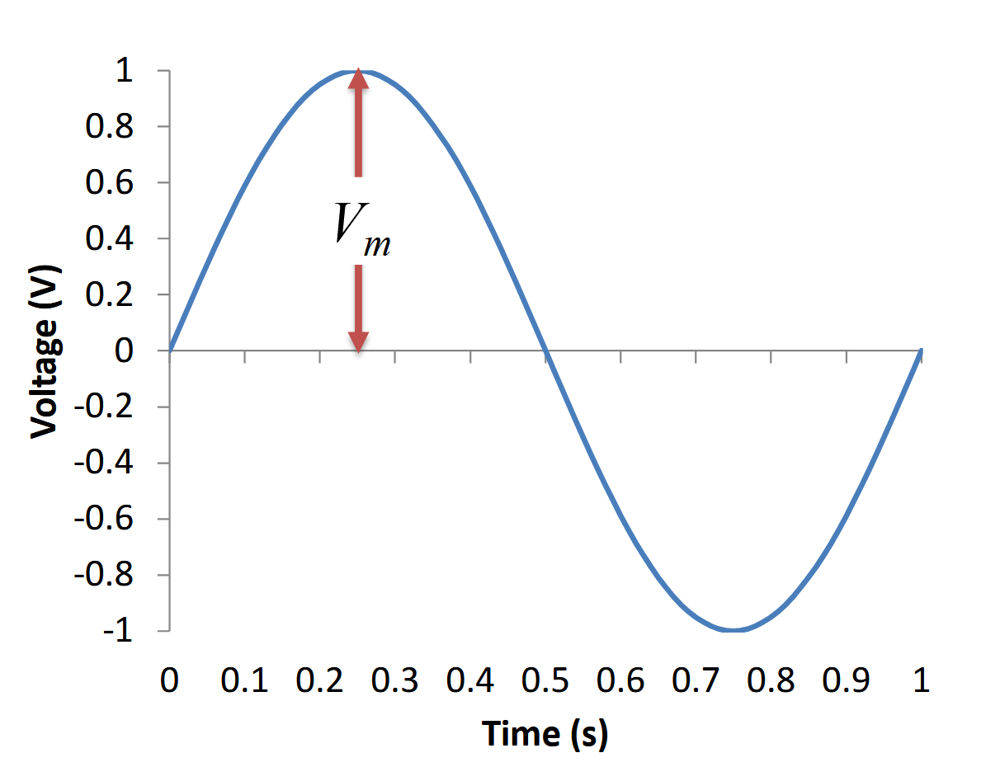
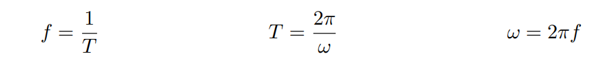
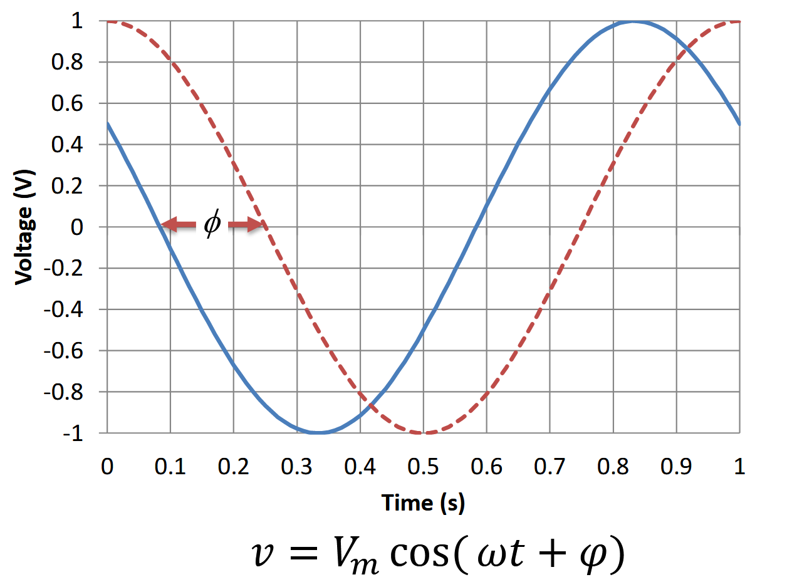
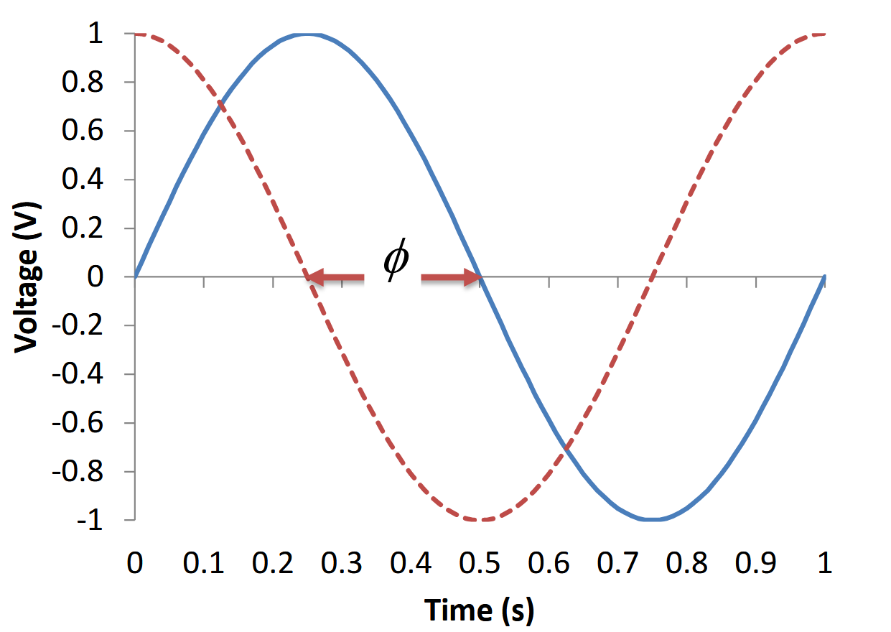
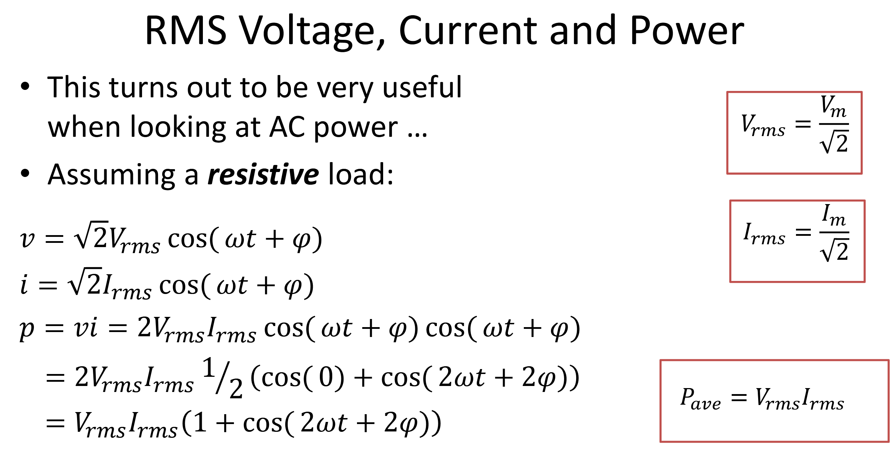
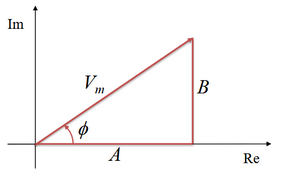

# Week 9- Sinusoidial signals

Content

- [x]   Features of Sinusoidal signal
- [x]   Root mean sqrt (Voltage, Current, Power)
- [x]   Phasor transform
- [ ]   Phasor relationship for **resistors**
- [ ]   Phasor relationship for **Inductors**
- [ ]   Phasor relationship for **capacitor**
- [ ]   

## Def:
- Commonly known to  as Alternating Current (AC)
  
- **Sinusoidal signals** are used extensively in power systems, but
are equally important in electronic systems.

* **Describes** the signal using cosine function
* $$v=v_m cos(\omega t+\Phi)$$
  
  **Formulas**:
    $f= \frac{1}{T}$ where $f$ is the frequency $Hz$ and T is the period
    
    $v=v_m cos(\omega t+\Phi)$; $vm$ is the amplitude of the wave, $\omega$ is the angular frequency, $\Phi$ is the phase.

+ Angular frequency is in radians per second:$$\omega = 2\pi f= \frac{2\pi}{T}$$
  
## Positive phase 

- Red dashed signal has
phase φ of 0 degrees.
- Blue signal is ahead in
time.
- Time difference, $\tau$, is 0.16 seconds.
-  Phase is: $\phi = \frac{\tau}{T}\times360= \frac{0.16}{1}× 360=60 \degree$

## Negative phase

$\tau= -0.25 s$
- Phase:
  $\phi = \frac{\tau}{T}\times360= \frac{-0.25}{1}× 360=-90 \degree$

## Root mean sqrt (rms)

* Root Mean Square is a method of obtaining a useful
average of a signal that is symmetric about the horizontal
axis.
* Defined as the square root of the mean value of the
function squared.
$$V_{rms}= \frac{V_m}{\sqrt{2}}$$
* $v_{m}$ is the amplitude of the function
$$I_{rms}= \frac{I_m}{\sqrt{2}}$$
### Power 

* In a resistive load, the power can be determined using the rms current and rms voltage.
  
⇒ $p=vi= V_{rms} I_{rms}(1+ cos(2\omega t+2\phi))$
The average power is given by:
$$p=vi= V_{rms} I_{rms}$$
## Sinusoidal Signal and Circuit Analysis
- The aim is to find the voltages and current in circuits like the
one below.
- The circuit elements will affect the magnitude and phase of the
signals, but **not the frequency**.
	
## The Phasor Transform
<Phasor transform changes the sin wave into vector>
- The **phasor transform** uses complex numbers to represent
sinusoidal signals and circuit elements.
-  Based on Euler’s identity:
  
### Euler's formula
$e^{j\theta}cos(\theta)+jsin(\theta)$
_where $j^2 =-1$ and $\theta$ is measured in radiant_

+ Real part of $e^{j\theta}= cos(\theta)$⇒ $\real\{e^{j\theta}\}=cos \theta$
+ Imaginary part of $e^{j\theta}= sin(\theta)$⇒ $\Im\ \{e^{j\theta}\}=sin \theta$
  
  Voltage signal:

$$
\begin{aligned}
v &=v_m cos(\omega t+\phi)\\
	&=v_m \real\{e^{j (\omega t+\phi)}\}\\
	&=v_m \real\{e^{j \phi}e^{j \omega t}\}\\
	&=\real\{v_m e^{j \phi}e^{j \omega t}\}\\
\end{aligned}
$$
+ The term $V_me^{jφ}$ has the magnitude and phase terms, and is the **phasor transform.**

## Using Phasor transform
$\therefore$

$P\{20 cos(\omega t+ 30\degree)\}$ can be written as $=20\angle 30\degree$

#### Example: Find the Phasor transform for: 
$$5\ cos(\omega t-40\degree)$$
##### Ans:

$P\{5 cos(\omega t+ 40\degree)\}= 5\angle- 40\degree$

* convert to reguangular form:
  
  $A= v_m cos \phi$ // **Real part**
  $B= v_m sin \phi$ // **imaginary part**
  $V= v_m cos \phi + j V_m sin \phi$
  
  * And back to polar:
    $v_m= \sqrt{A^2 +B^2}$
  
 $\phi = atan(\frac{B}{A})$ 

#### Example 2: Using Phasors:

we want to find $V_a +V_b$.
1. find Va and Vb as a phasol

   $P\{v_m cos(\omega t+ \phi \degree)\}= V_m\angle \phi\degree$

   1. $v_a= 20 cos(\omega t-30 \degree) V$
   2. $v_b= 40 sin(\omega t-60 \degree) V$
